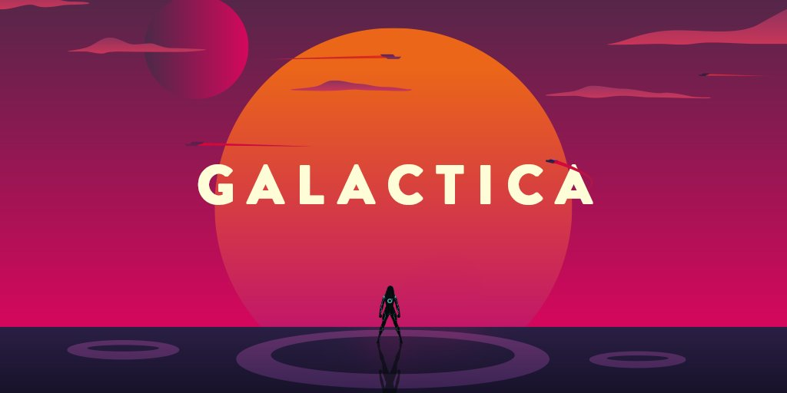

<!-- markdownlint-disable MD026 -->
# Hey there :wave:

Welcome on my GitHub Profile ! :wink:

## About me :eyes:

I'm Dorian, I was a chemistry technician and now I'm a french Web Developper looking for a job / traineeship ! :computer: :star:
I did my reconversion cursus at [@oclock_io](https://twitter.com/Oclock_io) with my favorite promotion ! :man_student: :man_astronaut:

I would like to thank them for all they did for me ! :bow:

## Languages and Tools :hammer_and_wrench:

In this cursus, I learnt a lot of techologies and tools in order to become a Fullstack JavaScript Developer :dizzy: :

- HTML5 & CSS3
- JavaScript ([Node.js](https://nodejs.org/en/) / [React](https://reactjs.org/) / [Redux](https://redux.js.org/))
- SQL / NoSQL ([PostgreSQL](https://www.postgresql.org/) / [MongoDB](https://www.mongodb.com/))
- API REST with [Express](http://expressjs.com/)
- API [GraphQL](https://graphql.org/) with [Apollo-Server](https://www.apollographql.com/docs/apollo-server/)
- Caching with [Redis](https://redis.io/)

But as Web Developpers, we are not stopping to study, we are always learning things ! :books:

:seedling: Now, I'm sharpening my JavaScript skills and I'm learning Python for Data Science on [Datacamp](https://www.datacamp.com/).
:construction_worker_man: I'm currently working on my project "Mur des Pensées" and I'm deploying a new Virtual Machine for my developement environment.:penguin:

## My Projects :book:

## Get in touch :coffee:

- Your future friend to discuss technologies or other things on [Twitter](https://twitter.com/dorian_speed).
- Your future employee on [LinkedIn](https://fr.linkedin.com/in/garcia-dorian-dev).
- And of course [GitHub](https://github.com/Dorianspeed) but it seems like you're already on it ! :man_shrugging:

### My GitHub stats :chart_with_upwards_trend:

### My most used languages :male_detective:

*NOTE: Top Languages does not indicate my skill level or anything like that, it's a GitHub metric of which languages have the most code on GitHub.*

### Visitor Counter :pencil:

It seems like you are not the first one ! :thinking:

<!--
**Dorianspeed/Dorianspeed** is a ✨ _special_ ✨ repository because its `README.md` (this file) appears on your GitHub profile.

Here are some ideas to get you started:

- 🔭 I’m currently working on ...
- 🌱 I’m currently learning ...
- 👯 I’m looking to collaborate on ...
- 🤔 I’m looking for help with ...
- 💬 Ask me about ...
- 📫 How to reach me: ...
- 😄 Pronouns: ...
- ⚡ Fun fact: ...
-->
